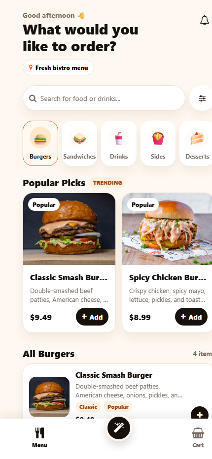
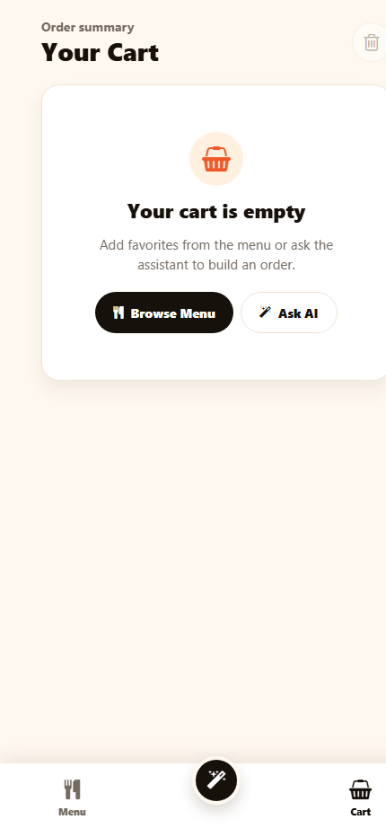
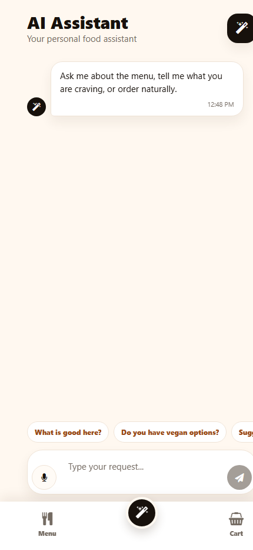
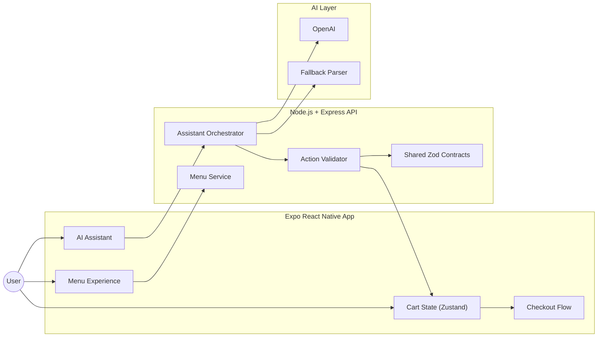
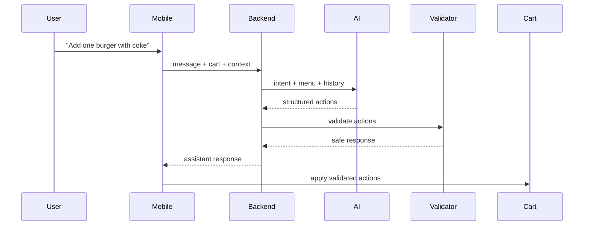
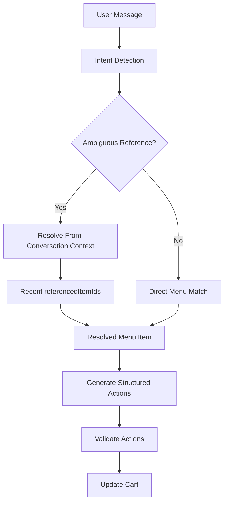
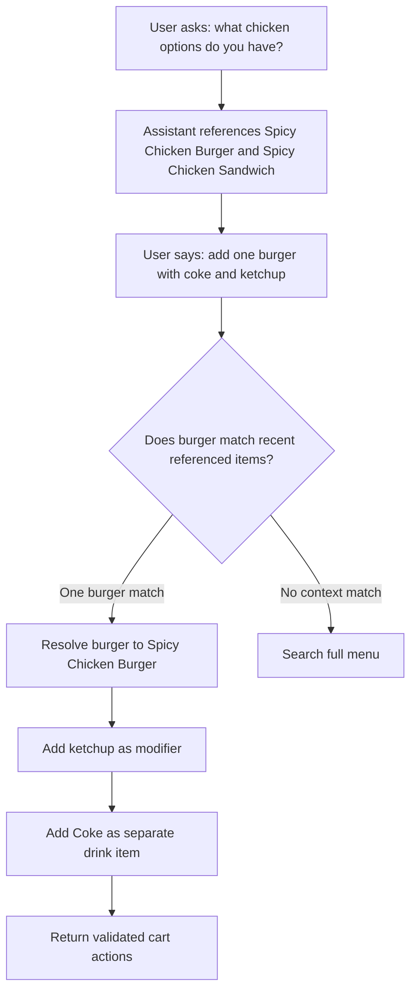
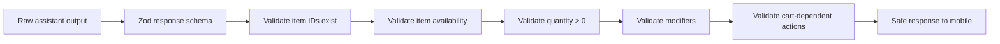

# Intelligent Bistro

Intelligent Bistro is a production-style restaurant ordering app built with Expo React Native and a TypeScript Express backend. Users can browse a seeded bistro menu, manage a cart, and use a conversational AI assistant to ask menu questions, get recommendations, update the cart, and move to payment when the order is complete.

The assistant is intentionally backend-orchestrated. The mobile app never calls OpenAI directly; it sends cart, menu, and conversation context to the API, receives validated structured actions, and only then mutates local cart state.

## Preview

| Menu | Cart | AI Assistant |
| --- | --- | --- |
|  |  |  |

## Highlights

- Premium mobile UI with menu browsing, cart controls, assistant chat, voice input, and payment handoff
- Conversational AI assistant that supports menu questions, recommendations, cart updates, clarification, and checkout intent
- Context-aware ordering, including references like `that`, `those`, `add one`, `the burger`, and `make it large`
- LLM-assisted ordering pipeline with deterministic validation and fallback parsing for production-style reliability
- Shared Zod contracts across mobile and server for request and response validation
- Server-side cart action validation before any action reaches the frontend
- Seeded menu data with categories, prices, images, tags, availability, and variants

## Tech Stack

| Layer | Technology |
| --- | --- |
| Mobile | Expo, React Native, TypeScript, Expo Router |
| State | Zustand |
| Backend | Node.js, Express, TypeScript |
| Validation | Zod shared contracts |
| AI | OpenAI API with deterministic fallback |
| Data | Seeded JSON menu |
| Tooling | npm workspaces |

## Architecture



## Assistant Flow



## Monorepo Structure

```text
intelligent-bistro/
  apps/
    mobile/          Expo React Native app
    server/          Express TypeScript API
  packages/
    contracts/       Shared Zod schemas and inferred TypeScript types
  docs/
    architecture.md
    assistant-context-examples.md
    ai-system-prompt.md
    demo-script.md
  README.md
  .env.example
  package.json
```

## Getting Started

### Prerequisites

- Node.js 20 or newer
- npm
- Expo web preview or Expo Go
- Optional: OpenAI API key

### Install

```bash
npm install
```

### Environment

Create a local `.env` file from the example:

```bash
cp .env.example .env
```

```env
PORT=4000
OPENAI_API_KEY=
OPENAI_MODEL=gpt-4.1-mini
EXPO_PUBLIC_API_URL=http://localhost:4000
```

Keep real API keys in `.env` only. Do not commit secrets.

### Run

Start the backend:

```bash
npm run dev:server
```

Start the mobile app:

```bash
npm run dev:mobile
```

For Expo web preview:

```bash
npm run web -w apps/mobile
```

## API Overview

### Health

```http
GET /api/health
```

### Menu

```http
GET /api/menu
GET /api/menu?category=Burgers
GET /api/menu/:itemId
```

### Assistant

```http
POST /api/assistant/message
```

Request:

```json
{
  "message": "Add two spicy chicken sandwiches and a large water",
  "cart": [],
  "menu": [],
  "conversationHistory": [],
  "lastReferencedItemIds": []
}
```

Response:

```json
{
  "intent": "cart_update",
  "assistantMessage": "Added 2 Spicy Chicken Sandwiches and 1 Large Water to your cart.",
  "actions": [
    {
      "type": "add",
      "itemId": "spicy_chicken_sandwich",
      "quantity": 2,
      "modifiers": [],
      "reason": "User clearly ordered this item."
    },
    {
      "type": "add",
      "itemId": "large_water",
      "quantity": 1,
      "modifiers": ["large"],
      "reason": "User clearly ordered a large water."
    }
  ],
  "needsClarification": false,
  "clarificationOptions": [],
  "referencedItemIds": ["spicy_chicken_sandwich", "large_water"],
  "confidence": 0.95
}
```

## Assistant Capabilities

| User intent | Example |
| --- | --- |
| Menu question | `Do you have anything vegan?` |
| Recommendation | `What is good here?` |
| Context follow-up | `Add two of those` |
| Add items | `Add one burger with coke and ketchup` |
| Update cart | `Make the coke large` |
| Remove items | `Remove the fries` |
| Cart summary | `What's in my cart?` |
| Checkout | `That's all, I'm ready to pay` |

## Demo Scenarios

Use these prompts to show the assistant's natural-language behavior and context resolution:

- `What chicken options do you have?`
- `Add one burger with coke and ketchup`
- `Make the coke large`
- `Remove the burger`
- `What's in my cart?`
- `I'm ready to pay`

## Context Resolution

The assistant tracks recent `referencedItemIds` so generic follow-ups resolve naturally.

### Context Resolution Engine



### Example Context Flow



Example result:

```json
{
  "actions": [
    {
      "type": "add",
      "itemId": "spicy_chicken_burger",
      "quantity": 1,
      "modifiers": ["ketchup"],
      "reason": "User used a generic item word resolved from recent assistant context."
    },
    {
      "type": "add",
      "itemId": "coke",
      "quantity": 1,
      "modifiers": [],
      "reason": "User clearly mentioned this menu item in the same request."
    }
  ]
}
```

## Voice And Payment

- Voice input is available in supported web previews through the browser Web Speech API.
- Voice responses are spoken back after voice requests when browser speech synthesis is available.
- If the user says the order is done, ready to pay, or wants checkout, the backend returns `checkout_intent`.
- The mobile app routes to the payment screen when checkout intent is returned and the cart has items.
- Native iOS/Android speech recognition can be added later with a native Expo speech package or backend audio transcription.

## Validation And Safety



The frontend does not trust raw assistant text. It applies only validated structured actions returned by the backend.

## Testing

Current verification commands:

- `npm run typecheck`
- `npm run lint`
- `npm run build`

Highest-value automated test coverage for this project:

- Assistant schema validation tests
- Cart action validation tests
- Context resolution test cases
- Fallback parser test cases

## Scripts

| Command | Description |
| --- | --- |
| `npm run dev:server` | Start the Express API in development mode |
| `npm run dev:mobile` | Start the Expo mobile app |
| `npm run typecheck` | Run TypeScript checks for all workspaces |
| `npm run lint` | Run lint checks for all workspaces |
| `npm run build` | Build shared contracts and server |

## Quality Notes

- TypeScript is used across mobile, server, and shared contracts.
- Zod schemas define API boundaries.
- Cart mutation is centralized in the Zustand store.
- The assistant endpoint uses OpenAI when configured and falls back safely when unavailable.
- The UI is mobile-first and optimized around repeated ordering workflows.

## Development Process

The project was built incrementally with meaningful commits across mobile UI, backend APIs, assistant orchestration, validation, and documentation.
