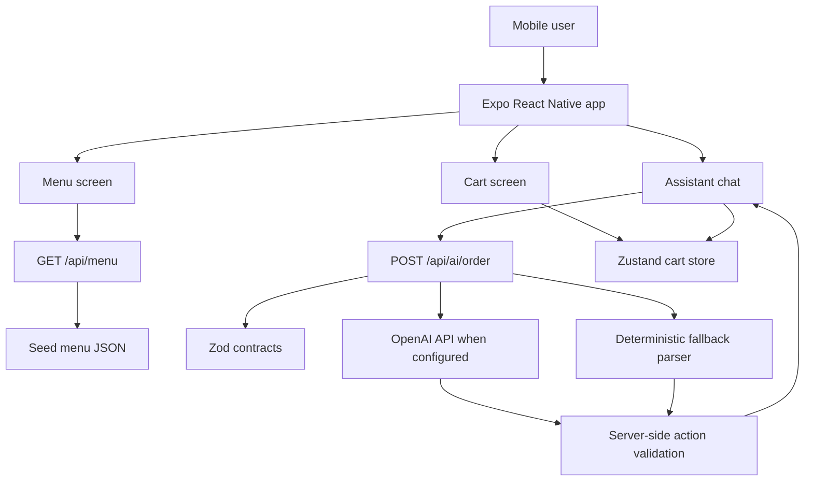

# Intelligent Bistro

Intelligent Bistro is a production-style take-home project for conversational restaurant ordering. It combines an Expo React Native mobile app with a TypeScript Express API so users can browse a menu, manage a cart, and use an AI assistant to update the cart through natural language.

The app is designed to run reliably with or without an OpenAI API key. When a key is available, the backend can call OpenAI. When it is not available, or when AI parsing fails, the backend uses a deterministic fallback parser so the demo remains usable.

## Features

- Menu browsing by category: Burgers, Sandwiches, Drinks, Sides, Desserts
- Polished mobile-first UI with warm bistro styling, food imagery, cards, and bottom tabs
- Zustand-powered cart with quantity controls, subtotal, tax, total, and empty state
- Conversational assistant for adding, removing, updating, clearing, and querying the cart
- Backend-only OpenAI integration with deterministic fallback parsing
- Shared Zod contracts for menu data, cart actions, and AI responses
- Structured assistant responses with `confidence`, `actions`, `assistantMessage`, and `errors`
- Error handling for unknown and ambiguous menu items

## Tech Stack

| Area | Tools |
| --- | --- |
| Mobile | Expo, React Native, TypeScript, Expo Router, Zustand |
| Backend | Node.js, Express, TypeScript, Zod, OpenAI SDK |
| Shared contracts | TypeScript workspace package, Zod schemas |
| Data | Seeded JSON menu |
| State/API | Zustand cart store, REST API |

## Architecture



More detail is available in [docs/architecture.md](docs/architecture.md).

## Repository Structure

```text
intelligent-bistro/
  apps/
    mobile/       Expo React Native app
    server/       Express TypeScript API
  packages/
    contracts/    Shared Zod schemas and TypeScript types
  docs/
    architecture.md
    ai-system-prompt.md
    demo-script.md
  README.md
  .env.example
  package.json
```

## Setup

Prerequisites:

- Node.js 20 or newer
- npm
- Expo-compatible browser or Expo Go for device testing

Install dependencies:

```bash
npm install
```

Create environment files as needed:

```bash
cp .env.example .env
```

OpenAI is optional:

```env
OPENAI_API_KEY=
OPENAI_MODEL=gpt-4.1-mini
EXPO_PUBLIC_API_URL=http://localhost:4000
```

The full backend prompt and response rules are documented in [docs/ai-system-prompt.md](docs/ai-system-prompt.md).

Run the backend:

```bash
npm run dev:server
```

Run the mobile app:

```bash
npm run dev:mobile
```

For web preview, use the Expo prompt or run:

```bash
npm run web -w apps/mobile
```

## API Overview

### Menu

```http
GET /api/menu
GET /api/menu?category=Burgers
GET /api/menu/:itemId
```

### AI Order Parsing

```http
POST /api/ai/order
```

Request:

```json
{
  "message": "Add two spicy chicken sandwiches and a large water",
  "cart": []
}
```

Response:

```json
{
  "intent": "cart_update",
  "actions": [
    {
      "type": "add",
      "itemId": "spicy_chicken_sandwich",
      "quantity": 2,
      "modifiers": []
    },
    {
      "type": "add",
      "itemId": "large_water",
      "quantity": 1,
      "modifiers": ["large"]
    }
  ],
  "assistantMessage": "Added 2 Spicy Chicken Sandwiches and 1 Large Water to your cart.",
  "confidence": 0.88,
  "errors": []
}
```

Additional supported prompts:

| Prompt | Expected action |
| --- | --- |
| `Add 2 burgers` | Adds a matched burger item |
| `Remove the fries` | Removes fries from cart |
| `Make the coke large` | Updates Coke modifiers |
| `Change chicken sandwich quantity to 3` | Updates quantity |
| `Clear my cart` | Clears the cart |
| `What's in my cart?` | Returns a cart query response |
